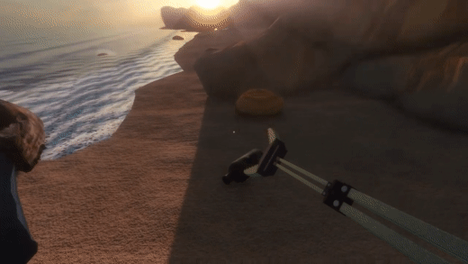

# The Green Game

The game can be downloaded here:

## https://branegames.itch.io/the-green-game

A Godot 3.5 game in which you pick up trash from a deserted beach.

The game was rushed and didn't get proper care till the end but I believe it can be useful example of a 3D game in Godot with a clear start and ending.

## Takeaways

If you are learning about developing 3D games in Godot this codebase can teach you how to:

- Make opening credits and menu
- Use other people plugins for faster prototyping
- Fake grab mechanics
- Combe **tool** and **export var** functionalities for some cool effects
- Use music and sound for creating atmosphere
- Apply materials to your 3D models
- Use 3D models from sketchfab
- Make closing credits

## Credits

Can be found in the [CREDITS.md](CREDITS.md) file.
